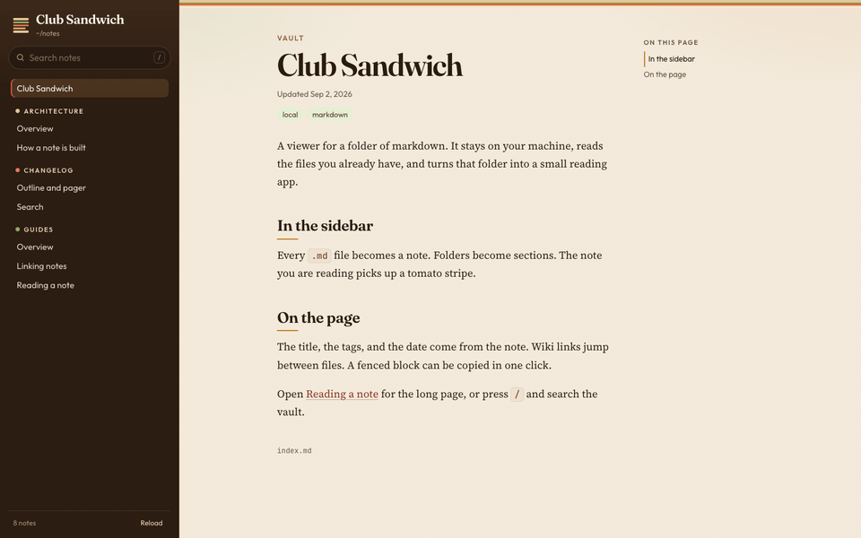
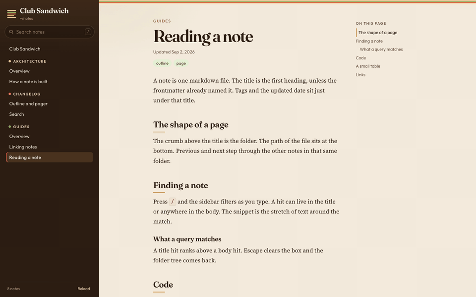
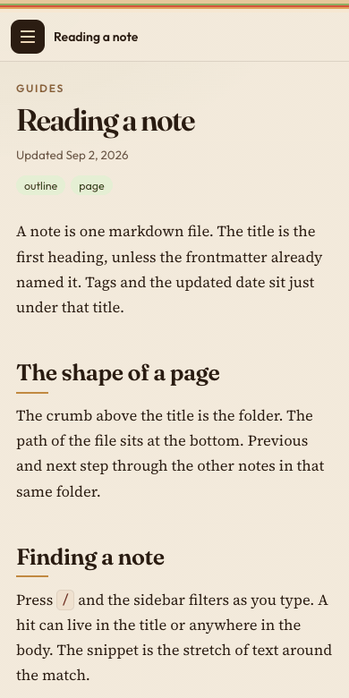

# Club Sandwich

A local viewer for a folder of markdown notes. It reads the `.md` files you already have, and serves them as a small reading app on your machine.



The sidebar is the folder. The current note gets a tomato stripe. Previous and next, at the bottom of the page, are the other notes in that same folder.


Search looks through titles and bodies. A title match ranks above a body match, and the query is marked in the result.



A note with more than one section gets an outline. It follows the heading in view. Fenced code keeps its language label, and Copy takes the text as written.



On a narrow window the sidebar tucks away. The menu button brings it back over the page.

## Run

```bash
node server.js
node server.js --notes ~/notes --port 8787
```

`npm start` does the same thing. The app listens on `127.0.0.1` only.

| Flag | Default |
| --- | --- |
| `--notes DIR` | `~/notes`, or `$NOTES_DIR` |
| `--port PORT` | `8787`, or `$PORT` |

There is nothing to install. The markdown parser is vendored in `public/vendor`.

Open a note directly at `/n/` plus its path, for example `http://127.0.0.1:8787/n/guides/reading.md`.

## Keys

| Key | Action |
| --- | --- |
| `/` | Focus search |
| `Cmd-K` or `Ctrl-K` | Focus search and select the query |
| `Esc` | Clear search, and close the sidebar on a narrow window |
| `[` | Previous note in this folder |
| `]` | Next note in this folder |

Reload rereads the folder from disk. The server does not watch for changes.

## Notes

Any `.md` file in the folder becomes a note. Nested folders become sections. Names that start with `.` are skipped, and so is a file larger than 2 MB.

The title comes from frontmatter, then from the first `#` heading, then from the filename. That first heading is not repeated in the body. `index.md` inside a folder is listed as Overview and sorted first. A folder named `changelog` sorts newest path first.

```markdown
---
title: Field notes
tags: [local, markdown]
---

Updated: 2026-09-02

The body starts here.
```

`Tags: local, markdown` on its own line works too, when frontmatter did not set tags.

Wiki links resolve inside the vault:

```markdown
[[reading]]
[[guides/reading|Reading a note]]
[[reading#code]]
```

A relative link to another `.md` file works the same way. A link with nowhere to go stays on the page, so a wrong name is still visible. HTML in a note is shown as text, which keeps literals such as `<task>` and `<sys/errno.h>` intact.

A few folder names have a set label: `guides`, `architecture`, `changelog`, `luna`, `asm-theory` (Assembly theory), and `lsm-theory` (LSM theory). Every other folder is title-cased from its name.
